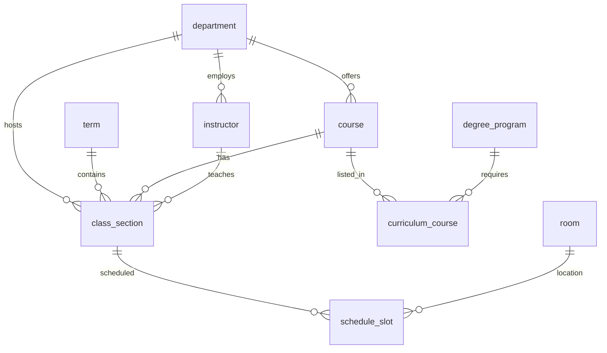

# SISIA Database Schema

## Overview

The SISIA database uses a **normalized schema with singular table names** and integer primary keys for optimal performance and chatbot querying.

## Entity Relationship Diagram



## Tables

### Lookup Tables (Deduplicated)

#### `department`

| Column       | Type        | Description                     |
| ------------ | ----------- | ------------------------------- |
| `id`         | INTEGER PK  | Auto-increment ID               |
| `code`       | TEXT UNIQUE | Dept code (e.g., "DISCS", "MA") |
| `name`       | TEXT        | Full name                       |
| `created_at` | DATETIME    | Timestamp                       |

#### `term`

| Column       | Type        | Description                |
| ------------ | ----------- | -------------------------- |
| `id`         | INTEGER PK  | Auto-increment ID          |
| `code`       | TEXT UNIQUE | Term code (e.g., "2025-2") |
| `year`       | INTEGER     | Academic year (2025)       |
| `semester`   | INTEGER     | 0=intersem, 1=1st, 2=2nd   |
| `created_at` | DATETIME    | Timestamp                  |

#### `instructor`

| Column          | Type        | Description                            |
| --------------- | ----------- | -------------------------------------- |
| `id`            | INTEGER PK  | Auto-increment ID                      |
| `name`          | TEXT UNIQUE | Full name (e.g., "YAP, ROMINA ANN S.") |
| `department_id` | INTEGER FK  | Reference to department                |
| `created_at`    | DATETIME    | Timestamp                              |

#### `room`

| Column        | Type        | Description                  |
| ------------- | ----------- | ---------------------------- |
| `id`          | INTEGER PK  | Auto-increment ID            |
| `code`        | TEXT UNIQUE | Room code (e.g., "SEC-A117") |
| `building`    | TEXT        | Building name if extracted   |
| `room_number` | TEXT        | Room number if extracted     |
| `created_at`  | DATETIME    | Timestamp                    |

### Data Tables

#### `course`

| Column          | Type        | Description                      |
| --------------- | ----------- | -------------------------------- |
| `id`            | INTEGER PK  | Auto-increment ID                |
| `course_code`   | TEXT UNIQUE | Course code (e.g., "MATH 30.13") |
| `title`         | TEXT        | Course title                     |
| `units`         | REAL        | Credit units                     |
| `department_id` | INTEGER FK  | Reference to department          |
| `created_at`    | DATETIME    | Timestamp                        |

#### `class_section`

| Column              | Type       | Description                   |
| ------------------- | ---------- | ----------------------------- |
| `id`                | INTEGER PK | Auto-increment ID             |
| `course_id`         | INTEGER FK | Reference to course           |
| `term_id`           | INTEGER FK | Reference to term             |
| `instructor_id`     | INTEGER FK | Reference to instructor       |
| `department_id`     | INTEGER FK | Reference to department       |
| `section`           | TEXT       | Section code (A, B, C1, etc.) |
| `max_capacity`      | INTEGER    | Maximum students              |
| `free_slots`        | INTEGER    | Available slots               |
| `lang`              | TEXT       | Language                      |
| `level`             | TEXT       | Level (GE, Major, etc.)       |
| `remarks`           | TEXT       | Additional notes              |
| `has_prerequisites` | INTEGER    | 0/1 flag                      |
| `created_at`        | DATETIME   | Timestamp                     |

**Unique Constraint**: `(course_id, term_id, section)`

#### `schedule_slot`

| Column       | Type       | Description                      |
| ------------ | ---------- | -------------------------------- |
| `id`         | INTEGER PK | Auto-increment ID                |
| `section_id` | INTEGER FK | Reference to class_section       |
| `room_id`    | INTEGER FK | Reference to room                |
| `day`        | TEXT       | Day name (Monday, Tuesday, etc.) |
| `start_time` | TEXT       | Start time (e.g., "0800")        |
| `end_time`   | TEXT       | End time (e.g., "0930")          |
| `modality`   | TEXT       | ONSITE, ONLINE, HYBRID           |
| `created_at` | DATETIME   | Timestamp                        |

#### `degree_program`

| Column             | Type        | Description                 |
| ------------------ | ----------- | --------------------------- |
| `id`               | INTEGER PK  | Auto-increment ID           |
| `code`             | TEXT UNIQUE | Program code                |
| `name`             | TEXT        | Full program name           |
| `is_honors`        | INTEGER     | 0/1 flag                    |
| `track`            | TEXT        | Optional track              |
| `specialization`   | TEXT        | Optional specialization     |
| `version_year`     | INTEGER     | Curriculum version year     |
| `version_semester` | INTEGER     | Curriculum version semester |
| `created_at`       | DATETIME    | Timestamp                   |

#### `curriculum_course`

| Column              | Type       | Description                 |
| ------------------- | ---------- | --------------------------- |
| `id`                | INTEGER PK | Auto-increment ID           |
| `degree_id`         | INTEGER FK | Reference to degree_program |
| `course_id`         | INTEGER FK | Reference to course         |
| `year`              | INTEGER    | Year level (1-5)            |
| `semester`          | INTEGER    | Semester (1 or 2)           |
| `prerequisites_raw` | TEXT       | Raw prerequisite text       |
| `corequisites_raw`  | TEXT       | Raw corequisite text        |
| `category`          | TEXT       | Course category             |
| `is_elective`       | INTEGER    | 0/1 flag                    |
| `created_at`        | DATETIME   | Timestamp                   |

**Unique Constraint**: `(degree_id, course_id)`

### Metadata Tables

#### `scrape_run`

| Column          | Type       | Description                      |
| --------------- | ---------- | -------------------------------- |
| `id`            | INTEGER PK | Auto-increment ID                |
| `started_at`    | DATETIME   | Scrape start time                |
| `completed_at`  | DATETIME   | Scrape end time                  |
| `term_code`     | TEXT       | Term being scraped               |
| `scrape_type`   | TEXT       | 'schedule', 'curriculum', 'all'  |
| `inserted`      | INTEGER    | New records count                |
| `updated`       | INTEGER    | Updated records count            |
| `unchanged`     | INTEGER    | Unchanged records count          |
| `removed`       | INTEGER    | Removed records count            |
| `total_scraped` | INTEGER    | Total from source                |
| `total_in_db`   | INTEGER    | Total in database                |
| `duration_ms`   | INTEGER    | Duration in milliseconds         |
| `status`        | TEXT       | 'running', 'completed', 'failed' |
| `error_message` | TEXT       | Error if failed                  |

## Indexes

```sql
-- Lookup table indexes
CREATE INDEX idx_instructor_name ON instructor(name);
CREATE INDEX idx_room_code ON room(code);
CREATE INDEX idx_course_code ON course(course_code);
CREATE INDEX idx_term_code ON term(code);

-- Foreign key indexes
CREATE INDEX idx_section_course ON class_section(course_id);
CREATE INDEX idx_section_term ON class_section(term_id);
CREATE INDEX idx_section_instructor ON class_section(instructor_id);
CREATE INDEX idx_section_dept ON class_section(department_id);
CREATE INDEX idx_curriculum_degree ON curriculum_course(degree_id);
CREATE INDEX idx_curriculum_course ON curriculum_course(course_id);
CREATE INDEX idx_slot_section ON schedule_slot(section_id);
CREATE INDEX idx_slot_room ON schedule_slot(room_id);
CREATE INDEX idx_slot_day ON schedule_slot(day);

-- Metadata indexes
CREATE INDEX idx_scrape_run_term ON scrape_run(term_code);
CREATE INDEX idx_scrape_run_started ON scrape_run(started_at);
```

## Chatbot-Friendly Views

### `v_full_schedule`

Complete schedule with all lookups - for detailed queries.

### `v_instructor_schedule`

Instructor classes by day - for "How many classes does X have on Friday?"

```sql
SELECT * FROM v_instructor_schedule
WHERE instructor LIKE '%YAP, ROMINA%' AND day = 'Friday';
```

### `v_course_room`

Course room distribution - for "Where are Bio classes held?"

```sql
SELECT room, SUM(slot_count) as total
FROM v_course_room WHERE course_code LIKE 'BIO%'
GROUP BY room ORDER BY total DESC;
```

### `v_term_summary`

Term statistics - for "How many classes in 24-25?"

```sql
SELECT term, section_count, course_count FROM v_term_summary
WHERE year IN (2024, 2025);
```

## Full-Text Search

The `course_fts` virtual table enables full-text search on courses:

```sql
SELECT c.* FROM course c
JOIN course_fts ON c.id = course_fts.rowid
WHERE course_fts MATCH 'mathematics';
```

## Statistics (January 2026)

| Entity         | Count  |
| -------------- | ------ |
| Departments    | 44     |
| Terms          | 4      |
| Instructors    | 1,741  |
| Rooms          | 315    |
| Courses        | 2,470  |
| Class Sections | 12,593 |
| Schedule Slots | 13,956 |
